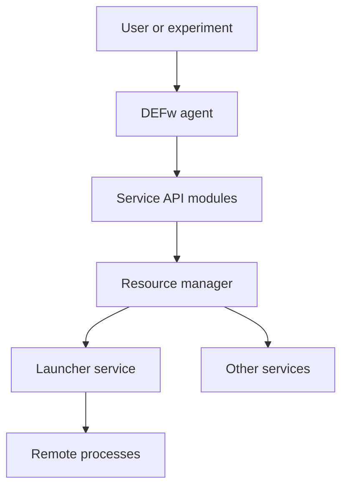
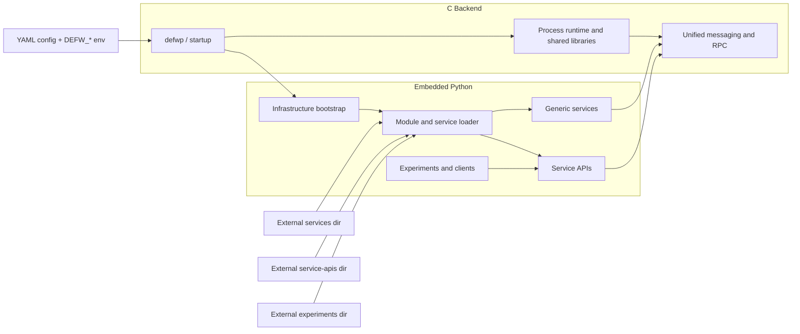

# Distributed Execution Framework

## Overview
DEFw is a standalone distributed execution infrastructure used to
start, connect, and manage agents, services, and experiments. It
combines a native runtime in `src/`, embedded Python infrastructure in
`python/infra/`, YAML-driven configuration in `python/config/`, and
pluggable services and APIs under `python/services/` and
`python/service-apis/`.

At runtime, a DEFw instance starts as one of three roles:
- `resmgr`: the root coordinator for a deployment
- `service`: a long-lived capability provider such as a launcher or
  other domain-specific service
- `agent`: a client or worker process that connects into the framework

Environment variables drive the runtime configuration, and the YAML
files expand those variables into a consistent runtime model.

## DEFw Topology


## High-Level Design
DEFw is split into a small C backend and an embedded Python layer. The C
backend provides the process runtime, startup path, shared libraries,
communication primitives, and a uniform way for distributed processes to
exchange messages. The embedded Python layer provides framework logic
such as module discovery, service loading, lifecycle management,
orchestration, and higher-level APIs.

This split keeps the transport and process-control path in native code
while allowing services and APIs to be implemented quickly in Python. A
DEFw process starts through `src/defwp`, loads its configuration from
the YAML file referenced by `DEFW_CONFIG_PATH`, initializes the native
runtime, then loads the requested Python modules for its role.

Services are generic plug-ins. DEFw does not require a fixed service
set. Users can provide their own services and service APIs without
modifying the core infrastructure by pointing the runtime at external
module directories with `DEFW_EXTERNAL_SERVICES_PATH`,
`DEFW_EXTERNAL_SERVICE_APIS_PATH`, and
`DEFW_EXTERNAL_EXPERIMENTS_PATH`.



## Running DEFw
1. Install Python dependencies:
   ```bash
   pip install -r requirements.txt
   ```
2. Build the native libraries, SWIG wrappers, and the `defwp` launcher:
   ```bash
   scons
   ```
3. Choose a startup profile and source it. Common examples in the repo include:
   ```bash
   source setup_resmgr.sh
   source setup_client.sh
   source setup_launcher.sh
   ```
4. Start the runtime:
   ```bash
   ./src/defwp
   ```

Typical local bring-up is:
1. Start the resource manager.
2. Start one or more services such as `svc_launcher`.
3. Start a client or experiment driver.

The setup scripts are the fastest way to get a working environment
because they export the expected DEFw variables for each role.

## Environment Variables
The table below lists the `DEFW_*` environment variables referenced by
the current DEFw code and configuration files in this repository.

| Variable | Description |
| --- | --- |
| `DEFW_AGENT_NAME` | Unique name for the current DEFw instance. |
| `DEFW_AGENT_TYPE` | Runtime role: `agent`, `service`, or `resmgr`. |
| `DEFW_CONFIG_PATH` | Path to the YAML configuration file consumed at startup. |
| `DEFW_DISABLE_RESMGR` | If set to `YES`, disables resource-manager handling in the Python infrastructure. |
| `DEFW_EXPECTED_AGENT_COUNT` | Expected number of agents for deployments that wait on a full set of workers. |
| `DEFW_EXTERNAL_EXPERIMENTS_PATH` | Extra search path for out-of-tree experiment modules. |
| `DEFW_EXTERNAL_SERVICE_APIS_PATH` | Extra search path for out-of-tree service API modules. |
| `DEFW_EXTERNAL_SERVICES_PATH` | Extra search path for out-of-tree service modules. |
| `DEFW_LISTEN_PORT` | Control port used by the current DEFw instance. |
| `DEFW_LOAD_NO_INIT` | Comma-separated modules to load without running normal initialization hooks. |
| `DEFW_LOG_DIR` | Directory used for logs, temp data, and other runtime artifacts. |
| `DEFW_LOG_LEVEL` | Logging verbosity for the runtime. |
| `DEFW_ONLY_LOAD_MODULE` | Comma-separated list of modules to load for a given process. |
| `DEFW_PARENT_ADDR` | Parent DEFw IP address or host address. |
| `DEFW_PARENT_HOSTNAME` | Parent DEFw hostname used by the generic YAML configuration. |
| `DEFW_PARENT_HNAME` | Legacy hostname variable used by some setup scripts; prefer `DEFW_PARENT_HOSTNAME`. |
| `DEFW_PARENT_NAME` | Name of the parent DEFw instance, typically the resource manager. |
| `DEFW_PARENT_PORT` | Parent DEFw listen port. |
| `DEFW_PATH` | Root path of the DEFw checkout or installation. |
| `DEFW_PREF_PATH` | Directory used by preference-related helper code. |
| `DEFW_SHELL_TYPE` | Execution mode such as `interactive`, `cmdline`, or `daemon`. |
| `DEFW_SQL_PATH` | Optional SQL output path referenced by reporting logic. |
| `DEFW_TELNET_PORT` | Optional telnet/debug port used by some startup modes. |
| `LD_LIBRARY_PATH` | Must include `src/` so the generated DEFw shared libraries can be loaded. |

## Repository Pointers
- `src/`: C runtime, SWIG inputs, generated wrappers, shared libraries,
  and `defwp`
- `python/infra/`: framework bootstrap, module loading, transport, and
  agent lifecycle
- `python/config/`: YAML templates expanded from environment variables
- `python/services/`: service implementations
- `python/service-apis/`: client-facing API layers
- `python/experiments/`: sample experiment suites and integration-style
  validation

# DEFw Wiki Documentation
Documentation is automatically generated by deepwiki.com
https://deepwiki.com/openQSE/DEFw

