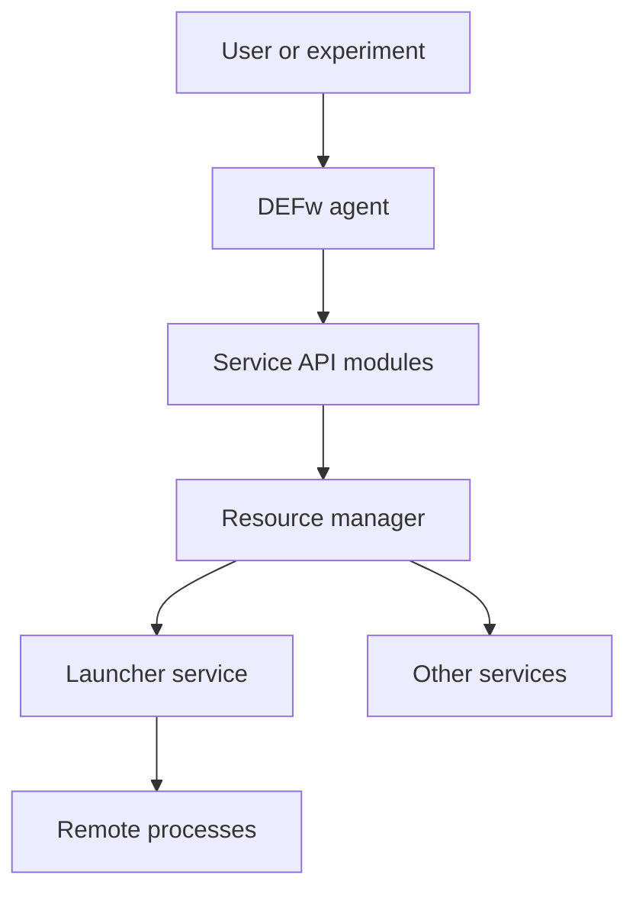
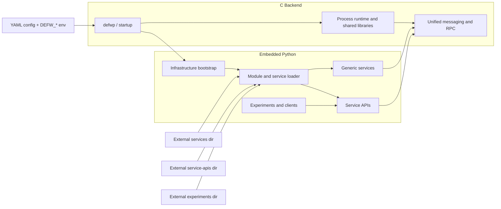

# Distributed Execution Framework

## Overview
DEFw is a standalone distributed execution infrastructure used to
start, connect, and manage agents, services, and experiments. It
combines a native runtime in `src/`, embedded Python infrastructure in
`python/infra/`, YAML-driven configuration in `python/config/`, and
pluggable services and APIs under `python/services/` and
`python/service-apis/`.

At runtime, a DEFw instance starts as one of three roles:
- `resmgr`: the root coordinator for a deployment
- `service`: a long-lived capability provider such as a launcher or
  other domain-specific service
- `agent`: a client or worker process that connects into the framework

Environment variables drive the runtime configuration, and the YAML
files expand those variables into a consistent runtime model.

## DEFw Topology


## High-Level Design
DEFw is split into a small C backend and an embedded Python layer. The C
backend provides the process runtime, startup path, shared libraries,
communication primitives, and a uniform way for distributed processes to
exchange messages. The embedded Python layer provides framework logic
such as module discovery, service loading, lifecycle management,
orchestration, and higher-level APIs.

This split keeps the transport and process-control path in native code
while allowing services and APIs to be implemented quickly in Python. A
DEFw process starts through `src/defwp`, loads its configuration from
the YAML file referenced by `DEFW_CONFIG_PATH`, initializes the native
runtime, then loads the requested Python modules for its role.

Services are generic plug-ins. DEFw does not require a fixed service
set. Users can provide their own services and service APIs without
modifying the core infrastructure by pointing the runtime at external
module directories with `DEFW_EXTERNAL_SERVICES_PATH`,
`DEFW_EXTERNAL_SERVICE_APIS_PATH`, and
`DEFW_EXTERNAL_EXPERIMENTS_PATH`.

In the current implementation, the Python infrastructure is also where
remote object lifecycle is defined. The client-side API base class
creates caller handles, the worker thread lazily imports service
modules, and the worker-side registries keep track of live remote
objects and singleton service instances.



## Remote Invocation Model
DEFw's remote APIs are Python classes derived from `BaseRemote` in
`python/infra/defw_remote.py`. A service API object is local to the
caller, but its methods are forwarded as RPCs to a Python object living
on the target DEFw process.

The normal flow is:
1. The client creates a service API object, usually from a service-info
   record returned by the resource manager.
2. `BaseRemote` generates a `class_id` caller handle unless one is
   supplied explicitly.
3. `BaseRemote` sends an `instantiate_class` RPC for the target Python
   service class.
4. `python/infra/defw_workers.py` imports the target module on demand
   with `importlib.import_module()`, then creates or reuses the server
   object.
5. Later method calls are sent as `method_call` RPCs carrying the same
   `class_id`.
6. The worker resolves the handle to the server-side object and invokes
   the requested Python method.
7. When the caller proxy is destroyed, `BaseRemote` sends a
   `destroy_class` RPC.

This means the C layer owns transport and process runtime, while Python
owns object identity, service lifecycle, and method dispatch.

## Service Instance Modes
Service modules can declare their instantiation policy through
`svc_info['instance_mode']`.

Supported modes are:
- `per_connection`: the default. Each caller-created remote proxy gets a
  distinct server-side Python object.
- `singleton`: all callers for the same service module and class share
  one server-side Python object.

The instance mode is read in `python/infra/defw_workers.py` and applied
when `instantiate_class` is handled. This keeps singleton policy in the
Python framework rather than in the transport layer.

## Object Identity And Singleton Aliases
DEFw now has two distinct identity layers for remote objects:

- `class_id`: the caller-visible handle carried in RPC messages and used
  for later method dispatch.
- `module_name:class_name`: the identity of a singleton service object
  on the server side.

This distinction is important:

- For `per_connection` services, one `class_id` maps to one server-side
  object.
- For `singleton` services, multiple caller-generated `class_id` values
  can alias the same underlying server-side instance.

The registries for this live in `python/infra/defw_common_def.py`:
- `global_class_db`: `class_id -> instance`
- `global_singleton_db`: `module_name:class_name -> instance`
- `global_singleton_alias_db`: `class_id -> module_name:class_name`

The alias model lets independent clients create their own proxies
without coordinating UUIDs while still landing on one shared singleton
service instance.

## Singleton Lifecycle
Singleton services are created lazily on first use. When a singleton
service receives its first `instantiate_class`, the worker creates the
service object and stores it in the singleton registry. Later callers
reuse that object and only add new caller-handle aliases.

Singleton teardown is explicit:
- destroying one caller proxy removes only that caller's `class_id`
  alias
- shutting down the service should remove the underlying singleton entry

Service code should call
`python/infra/defw_common_def.shutdown_service_instance(self)` during
service shutdown rather than manipulating the singleton registry
directly. This keeps registry cleanup opaque to service implementations.

## Module Loading And Reloading
DEFw lazily imports Python service modules on first use with
`importlib.import_module()`. A loaded module is not re-executed on every
RPC under normal operation.

Module reload is available only as a debugging aid through the DEFw
preferences layer:
- default behavior: no forced reload on RPC dispatch
- debug behavior: reload the module before dispatch if the debug reload
  preference is enabled

This matters for singleton services because repeatedly reloading a
module while keeping long-lived service objects alive underneath it is a
fragile runtime model. The default behavior is therefore load-on-first-
use, not reload-on-every-call.

## Resource Manager Special Case
The resource manager service, `DEFwResMgr`, is treated specially in the
worker dispatch path. The active resource manager object already exists
on the server side, so the worker binds caller handles to that existing
object rather than constructing a fresh one on demand.

Conceptually, this is the same shared-instance model used by singleton
services, but it remains a dedicated special case in the current code.

## Running DEFw
1. Install Python dependencies:
   ```bash
   python3 -m pip install -r requirements.txt
   ```
2. Build the native libraries, SWIG wrappers, and the `defwp` launcher:
   ```bash
   scons
   ```
3. Start the runtime directly with a configured environment:
   ```bash
   ./src/defwp
   ```

Typical bring-up still follows the same role order:
1. Start the resource manager.
2. Start one or more services such as `svc_launcher`.
3. Start a client or experiment driver.

Older `setup_*.sh` helper scripts have been removed because they encoded
machine-specific paths and were not portable across checkouts or sites.
For local validation and regression testing, use the test-runner flow
documented below.

## Test Runner Workflow
The supported local test entry point is
`python/tests/defw_test_runner.py`. It builds the DEFw environment for a
run, writes a temporary preference file, launches `src/defwp`, selects
an experiment suite and scripts, and collects logs under the configured
log directory.

### Prerequisites
Run all commands below from the `DEFw/` directory after building:

```bash
cd /path/to/QFw/DEFw
python3 -m pip install -r requirements.txt
scons
```

### Built-In Configurations
List the available built-in configs:

```bash
python3 python/tests/defw_test_runner.py --list-configs
```

At present this prints:
- `framework.yaml`
- `smoke.yaml`

You can invoke those built-in configs either by filename or by the
short name without `.yaml`.

### Exact Commands
Run the smallest built-in test:

```bash
python3 python/tests/defw_test_runner.py smoke
```

Equivalent filename form:

```bash
python3 python/tests/defw_test_runner.py smoke.yaml
```

Run the full framework suite:

```bash
python3 python/tests/defw_test_runner.py framework
```

Run one script from a configuration:

```bash
python3 python/tests/defw_test_runner.py framework --script remote_exception_format
```

Run one script using the explicit `suite::script` selector:

```bash
python3 python/tests/defw_test_runner.py framework --script framework::remote_exception_format
```

Preview the resolved command and DEFw environment without executing the
test:

```bash
python3 python/tests/defw_test_runner.py smoke --dry-run
```

Run a custom YAML configuration by path:

```bash
python3 python/tests/defw_test_runner.py /absolute/path/to/my_config.yaml
```

### How Configurations Work
Each YAML file in `python/tests/configs/` tells the runner:
- which experiment suite to load
- which scripts in that suite to execute
- which modules to preload in the main DEFw process
- which ports, logs, and reporting settings to use

For example, `python/tests/configs/smoke.yaml` runs the `framework`
suite and executes only `remote_exception_format`.

The `modules:` list is combined with the runner defaults
`svc_resmgr,api_resmgr`. The runner also sets `DEFW_SHELL_TYPE=cmdline`,
builds `DEFW_ONLY_LOAD_MODULE`, writes `DEFW_PREF_PATH`, and defaults
the log root to `master.log_dir`.

### Adding New Services, Service APIs, Experiments, And Test Configs
DEFw discovers modules by naming convention:
- services live under `python/services/` in packages named `svc_*`
- service APIs live under `python/service-apis/` in packages named
  `api_*`
- experiment suites live under `python/experiments/` in directories
  named `suite_*`
- experiment scripts inside a suite are files named `exp_*.py`

Examples already in this repository:
- service: `python/services/svc_test_echo/`
- service API: `python/service-apis/api_test_echo/`
- experiment suite: `python/experiments/suite_framework/`
- experiment script:
  `python/experiments/suite_framework/exp_remote_exception_format.py`

To add a new service:
1. Create `python/services/svc_my_service/`.
2. Add `__init__.py` and the implementation module, for example
   `svc_my_service.py`.
3. Follow the existing service pattern so the module exports the DEFw
   metadata and server-side class expected by the framework.

To add a matching service API:
1. Create `python/service-apis/api_my_service/`.
2. Add `__init__.py` and `api_my_service.py`.
3. Derive the client-facing class from `BaseRemote`.

To add a new experiment:
1. Create a suite such as `python/experiments/suite_my_feature/`.
2. Add scripts such as `exp_basic.py`.
3. Provide a `run()` function in each script.

To add a new test configuration:
1. Create `python/tests/configs/my_feature.yaml`.
2. Set `suite:` to the suite name without the `suite_` prefix.
3. List scripts without the `exp_` prefix and without `.py`.
4. Add any extra modules under `modules:`.

A minimal config looks like this:

```yaml
suite: my_feature
scripts:
  - basic
modules:
  - api_my_service
master:
  agent_name: master-resmgr
  listen_port: 25200
  telnet_port: 25201
  experiment_port_base: 25210
  report_mode: both
  log_level: DEBUG
  log_dir: /tmp/defw-my-feature
```

Run that config with:

```bash
python3 python/tests/defw_test_runner.py my_feature
```

or:

```bash
python3 python/tests/defw_test_runner.py python/tests/configs/my_feature.yaml
```

### Logs
The runner writes logs to the `master.log_dir` directory from the chosen
config and then collects per-process logs under `process_logs/` beneath
that root.

## Environment Variables
The table below lists the `DEFW_*` environment variables referenced by
the current DEFw code and configuration files in this repository.

| Variable | Description |
| --- | --- |
| `DEFW_AGENT_NAME` | Unique name for the current DEFw instance. |
| `DEFW_AGENT_TYPE` | Runtime role: `agent`, `service`, or `resmgr`. |
| `DEFW_CONFIG_PATH` | Path to the YAML configuration file consumed at startup. |
| `DEFW_DISABLE_RESMGR` | If set to `YES`, disables resource-manager handling in the Python infrastructure. |
| `DEFW_EXPECTED_AGENT_COUNT` | Expected number of agents for deployments that wait on a full set of workers. |
| `DEFW_EXPERIMENT_PORT_BASE` | Base port range used when experiments spawn additional service processes. |
| `DEFW_EXTERNAL_EXPERIMENTS_PATH` | Extra search path for out-of-tree experiment modules. |
| `DEFW_EXTERNAL_SERVICE_APIS_PATH` | Extra search path for out-of-tree service API modules. |
| `DEFW_EXTERNAL_SERVICES_PATH` | Extra search path for out-of-tree service modules. |
| `DEFW_LISTEN_PORT` | Control port used by the current DEFw instance. |
| `DEFW_LOAD_NO_INIT` | Comma-separated modules to load without running normal initialization hooks. |
| `DEFW_LOG_DIR` | Directory used for logs, temp data, and other runtime artifacts. |
| `DEFW_LOG_LEVEL` | Logging verbosity for the runtime. |
| `DEFW_ONLY_LOAD_MODULE` | Comma-separated list of modules to load for a given process. |
| `DEFW_PARENT_ADDR` | Parent DEFw IP address or host address. |
| `DEFW_PARENT_HOSTNAME` | Parent DEFw hostname used by the generic YAML configuration. |
| `DEFW_PARENT_HNAME` | Legacy hostname variable used by some older setup scripts; prefer `DEFW_PARENT_HOSTNAME`. |
| `DEFW_PARENT_NAME` | Name of the parent DEFw instance, typically the resource manager. |
| `DEFW_PARENT_PORT` | Parent DEFw listen port. |
| `DEFW_PATH` | Root path of the DEFw checkout or installation. |
| `DEFW_PREF_PATH` | Path to the DEFw preference YAML file loaded at runtime. |
| `DEFW_REPORT_MODE` | Controls aggregate test result rendering: `summary`, `detail`, or `both`. |
| `DEFW_SHELL_TYPE` | Execution mode such as `interactive`, `cmdline`, or `daemon`. |
| `DEFW_SQL_PATH` | Optional SQL output path referenced by reporting logic. |
| `DEFW_TELNET_PORT` | Optional telnet/debug port used by some startup modes. |
| `LD_LIBRARY_PATH` | Must include `src/` so the generated DEFw shared libraries can be loaded. |

## Repository Pointers
- `src/`: C runtime, SWIG inputs, generated wrappers, shared libraries,
  and `defwp`
- `python/infra/`: framework bootstrap, module loading, transport, and
  agent lifecycle, RPC dispatch, object registries, and preferences
- `python/config/`: YAML templates expanded from environment variables
- `python/services/`: service implementations
- `python/service-apis/`: client-facing API layers
- `python/experiments/`: sample experiment suites and integration-style
  validation

# DEFw Wiki Documentation
Documentation is automatically generated by deepwiki.com
https://deepwiki.com/openQSE/DEFw
