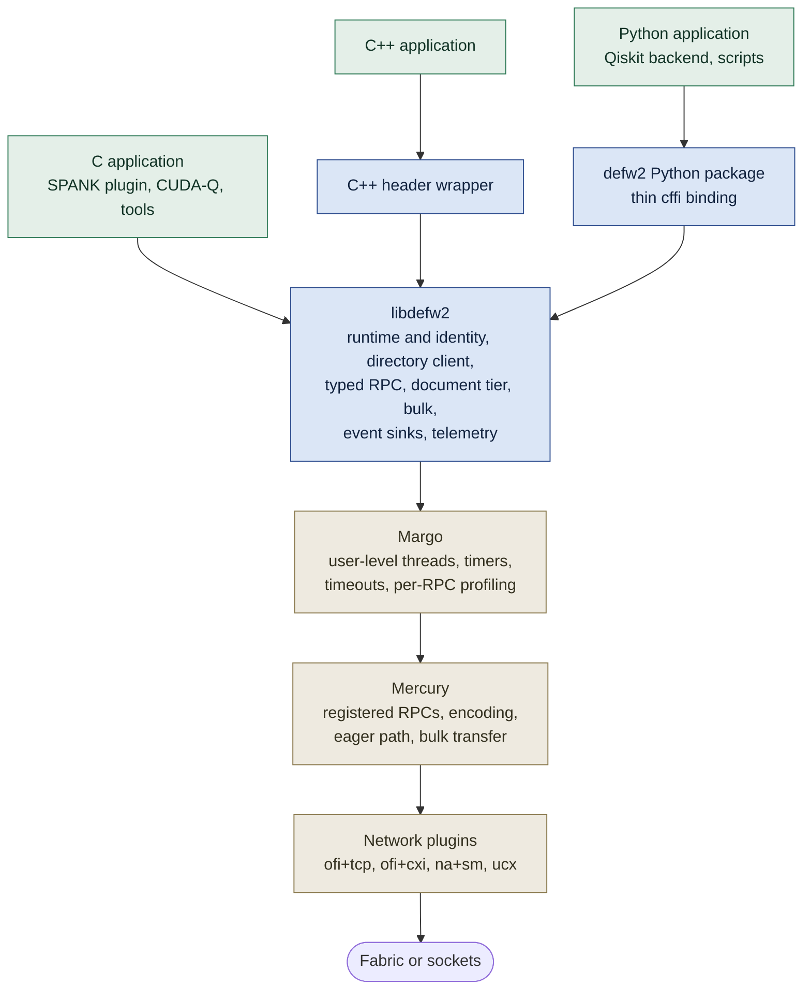
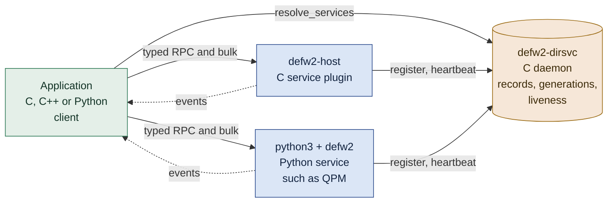
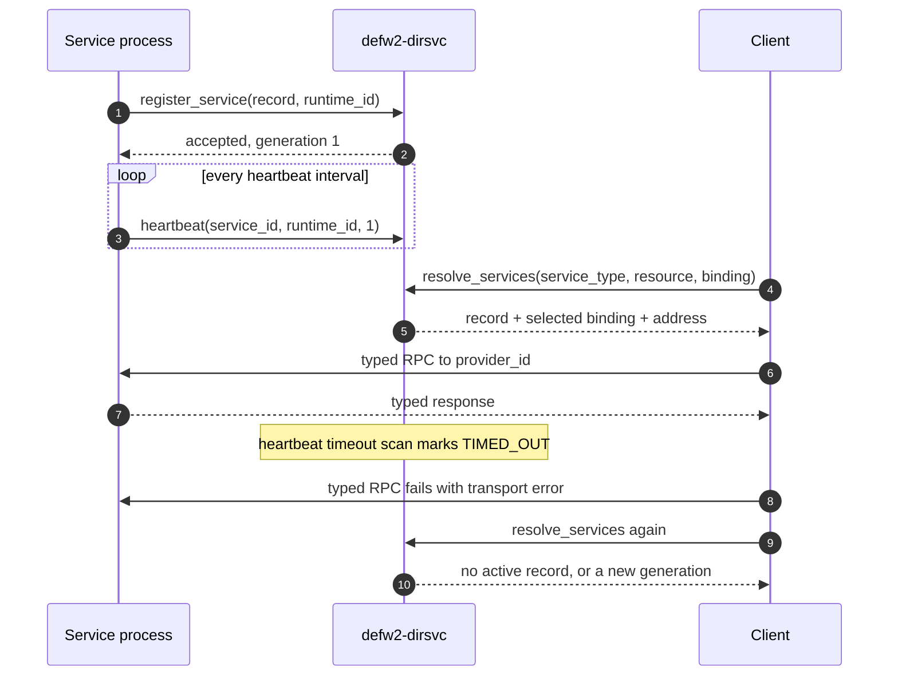
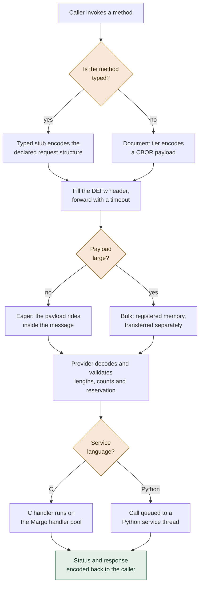
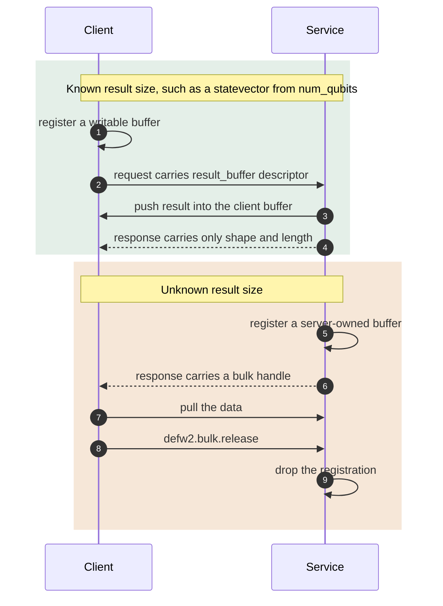
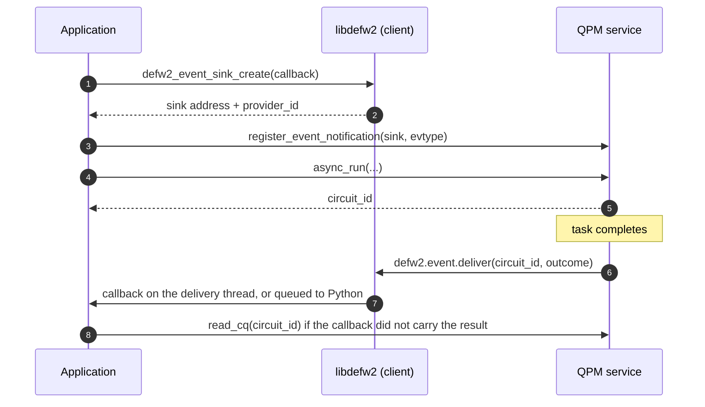
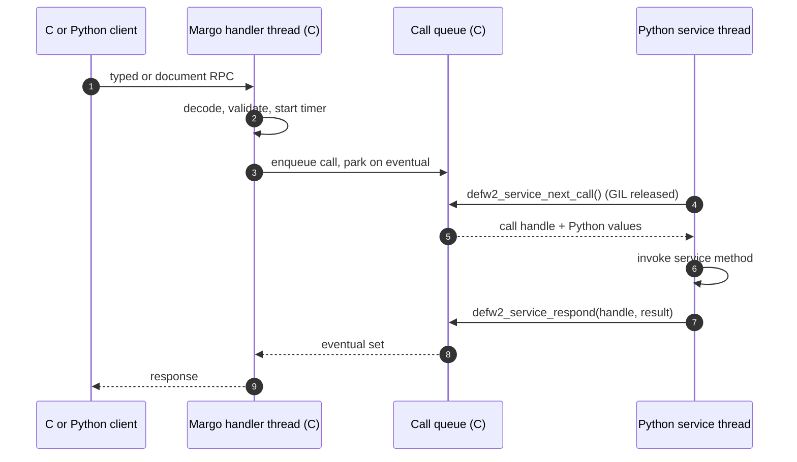
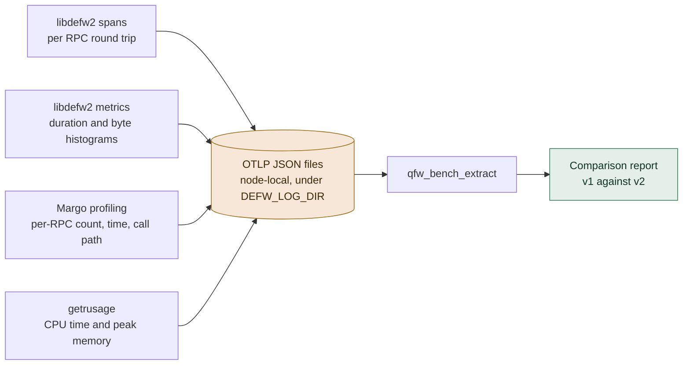
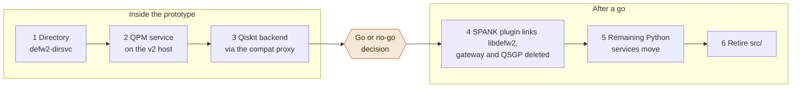

# DEFw v2 Design Proposal

**Status:** draft
**Owner:** Doug Oucharek
**Date:** 4 September 2026

## Executive Summary

DEFw v1 puts its application layer in Python. The C runtime owns processes,
sockets and the fabric, while the remote-object model, the directory service,
method dispatch and the wire format all live in an embedded interpreter. Two
consequences now block work. A C program cannot join DEFw at all, which is why
the Slurm integration had to grow a separate Python gateway daemon that its own
design document calls a temporary boundary. And the wire is a PyYAML dump read
back with an unsafe loader, so any peer that can reach an RPC port can execute
code in the receiving process.

This proposal builds DEFw v2 as a C library in a new `src2/` directory beside
the existing `src/`, on top of Mercury and Margo, the RPC and runtime layers of
Argonne National Laboratory's Mochi project. v1 is untouched. The two versions
build and run side by side in one container so they can be measured against
each other.

**Why Mercury.** It is the RPC layer under DAOS, in production on Aurora over
Slingshot, and it already supplies what DEFw would otherwise keep building by
hand: typed encoding, an eager path for small messages, bulk transfer over
registered memory, per-provider fabric knowledge, timeouts and cancellation,
and the Slingshot support that DEFw v1's own transport plan has not yet
reached. Margo adds sequential handlers on user-level threads and per-RPC
profiling. Both are permissively licensed, and reusing another DOE laboratory's
work suits the ORNL mandate.

**What stays ours.** Mercury has no directory, no liveness and no
authentication. Service identity, generations, registration, discovery,
heartbeats and the QFw API surface remain DEFw's. That is the part of DEFw
that is actually specific to this project, and it is where the design effort
belongs.

**The C-first rule.** Anything a C application needs is implemented once, in C.
The directory service becomes a C daemon. Python services become ordinary
`python3` processes that import a thin binding, with no embedded interpreter
anywhere. Python keeps its place as a service and client language without
defining the wire or the object model.

**The main risk** is that QFw's services are Python and would now sit on a C
RPC runtime. Mochi's own documentation warns that Python's global interpreter
lock can stall Mercury's progress loop. The design answers this by keeping
Python off Margo threads entirely, and the first phase's exit criterion is
proving that this holds under concurrent load. If it does not hold, the answer
is no-go.

**How the decision gets made.** Profiling is built in from the first commit and
emits in the vocabulary QFw already uses for benchmarking, so the prototype
produces a like-for-like comparison against v1 on the same workloads,
providers and container. Four phases lead to a comparison report and a
documented go or no-go decision, with success targets fixed in advance so the
evaluation cannot be fitted to the result. The first payoff after a go is the
Slurm plugin calling DEFw directly in C and the gateway daemon being deleted.

## Table of Contents

- [Executive Summary](#executive-summary)
- [Purpose and Scope](#purpose-and-scope)
- [Motivation](#motivation)
- [Goals and Non-Goals](#goals-and-non-goals)
- [Why Mercury and Margo](#why-mercury-and-margo)
- [Architecture Overview](#architecture-overview)
- [What Moves from Python to C](#what-moves-from-python-to-c)
- [Source Layout and Build](#source-layout-and-build)
- [Core Runtime](#core-runtime)
- [Directory Service](#directory-service)
- [RPC Model](#rpc-model)
- [Bulk Data](#bulk-data)
- [Events and Completion Notification](#events-and-completion-notification)
- [Language Bindings](#language-bindings)
- [Profiling and the v1 Comparison](#profiling-and-the-v1-comparison)
- [Configuration and Deployment](#configuration-and-deployment)
- [Coexistence and Migration](#coexistence-and-migration)
- [Security](#security)
- [Relationship to the C-Centric Requirements](#relationship-to-the-c-centric-requirements)
- [Risks and Open Questions](#risks-and-open-questions)
- [Phased Plan](#phased-plan)
- [Success Criteria](#success-criteria)
- [Appendix A: DEFw v1 Inventory](#appendix-a-defw-v1-inventory)
- [Appendix B: Dependencies and Licenses](#appendix-b-dependencies-and-licenses)
- [Appendix C: References](#appendix-c-references)

## Purpose and Scope

This document proposes DEFw v2, a prototype of the Distributed Execution
Framework rebuilt as a C library on top of the Mercury RPC library and the
Margo runtime from the Mochi project at Argonne National Laboratory. The
prototype lives in a new `src2/` directory beside the current `src/` so the
two versions can be built, run and measured side by side.

The prototype exists to answer one question with numbers: does a C-first
DEFw on Mercury perform materially better than the current DEFw, and will it
cost less to maintain, when C applications are first-class callers? The
document describes the architecture, the profiling built in from the start,
the comparison method, and the phased plan to a go or no-go decision.

The document assumes the reader knows DEFw v1 and QFw. Appendix A gives the
v1 inventory the design refers to.

## Motivation

DEFw v1 splits into a C runtime and an embedded Python layer. The C side owns
processes, sockets, the libfabric data path and heartbeats. The Python side
owns everything an application actually calls: the remote proxy model, method
dispatch, the directory service, the peer table, service registration and
attachments. Two consequences of that split are now blocking work.

**A C program cannot join DEFw.** The only entry point is `defw_start()`,
which initialises the embedded CPython interpreter before it starts the
listener. The C-visible RPC call is `defw_send_req(dst, blk, char *yaml)`, and
the YAML it carries is PyYAML's rendering of Python objects, including
`!!python/tuple` and `!!python/object:defw_agent.Endpoint` tags. The Slurm
SPANK plugin runs inside slurmd and srun and cannot embed an interpreter. That
is why the Slurm integration grew a separate Python gateway daemon, plus a
bespoke protocol to reach it, the Quantum Scheduler Gateway Protocol (QSGP).
The Slurm design document in QFw calls that daemon "the temporary C-to-Python
boundary". CUDA-Q and any future C++ integration face the same wall. An issue
asking for exactly this capability, `openQSE/DEFw` issue #9 "Support C
services", has been open since April 2026.

**The wire is Python and it is unsafe.** Every request is `yaml.dump` of the
argument tuple and is read back with `yaml.load(msg, Loader=yaml.Loader)`, the
full loader. Full-loader YAML constructs arbitrary Python objects, so any peer
that can reach the RPC port can execute code in the receiving process. The
Slurm design already treats clients as untrusted, which is why QSGP carries
MUNGE authentication. The wire also binds every participant to the same
CPython version, which is the root of the `defw-python` entry point and the
virtual environment rules in the QFw detailed design.

**The transport work has reached the point of diminishing returns on its
own.** DEFw v1 has its own libfabric transport plan, designed in
`docs/libfabric-transport-design.md` in the QFw repository and delivered in
four phases. Phases 0, 1 and 3 are merged, as `openQSE/DEFw` pull requests #15
and #16. They gave DEFw an OFI data path, where OFI is the OpenFabrics
Interfaces API that libfabric implements, and RMA attachments, where RMA is
remote memory access. Along the way they reproduced provider
knowledge that mature HPC RPC libraries already encode: memory registration
modes, key management, virtual-address versus offset addressing, an eager
buffer that truncates at 256 KiB and falls back to TCP. Phase 2, Slingshot
bring-up, has not started. Most of that remaining work is exactly what
Mercury already does, including the Slingshot provider.

Amir Shehata's C-centric requirements document, `docs/requirements-c.md` on
the `release/v0.1` branch of the QFw repository, reaches the same conclusion
from the API side. DEFw needs a stable C interface, a private binary wire,
typed requests and responses, and a bulk path that does not change the service
API. Its adoption gate asks for a
bounded prototype compared against Mercury and Margo before any generator work
starts. This proposal is that prototype, with Mercury and Margo chosen as the
foundation rather than as the comparison target. The relationship to the
individual requirements is in
[Relationship to the C-Centric Requirements](#relationship-to-the-c-centric-requirements).

## Goals and Non-Goals

### Goals

1. A C application links one library, joins a DEFw deployment, resolves a
   service through the directory, calls typed RPCs, moves bulk data and
   receives events, without an embedded interpreter anywhere in the process.
2. Everything a C application needs is implemented once in C. Other
   languages bind to that C library rather than re-implementing it.
3. Python remains a first-class client and service language through a thin
   binding, so existing QFw services and the Qiskit backend can move with
   small adapters rather than rewrites.
4. Mercury and Margo carry RPC, serialization, progress, bulk transfer and
   fabric support. DEFw keeps what is specific to it: the directory, service
   identity and generations, registration, liveness, configuration, and the
   QFw API surface.
5. Profiling is built in from the first commit, emits in the vocabulary of
   the QFw benchmarking design, and produces a like-for-like comparison with
   v1 on the same workloads and providers.
6. v1 and v2 coexist in one tree and one container. QFw can switch one
   process role at a time.

### Non-Goals

- Backward compatibility with the v1 wire or with the v1 Python remote-object
  model. v2 does not carry YAML, `instantiate_class`, `destroy_class` or
  `class_id`.
- A code generator. Typed request and response structures are hand-written
  Mercury proc definitions in the prototype. A generator can target the same
  macros later if the method count justifies it.
- Replacing the QFw launcher, the experiment and suite framework, or the
  telnet shell. They stay in Python and out of scope for the prototype.
- Authentication. v2 keeps the v1 posture and leaves a hook for it.
- Slingshot validation inside the prototype phases. The design keeps the
  provider swap to a configuration change, and Slingshot measurement is the
  first task after the go decision.

## Why Mercury and Margo

Mercury is a C RPC library built for HPC. Its network abstraction layer has
plugins for libfabric, UCX and shared memory. It provides registered RPCs
with encoded request and response structures, an eager path for small
messages, and bulk transfers over registered memory for large ones. Margo
sits on Mercury and Argobots and turns Mercury's callback model into
sequential code on user-level threads: a forward blocks the calling thread,
handlers run in a pool separate from the progress loop, and timeouts and
cancellation are library calls.

The evidence that the stack is production-grade is direct. Every byte of DAOS
traffic goes through Mercury via DAOS's CaRT layer, including the Aurora
deployment over Slingshot. Mercury's maintainer works on the DAOS side, so
DAOS's needs drive Mercury's roadmap. The HDF5 asynchronous VOL connectors and
every Mochi data service use the same stack.

### What the stack supplies, mapped to what DEFw would otherwise build

| Concern | DEFw v1 today | Still to build if DEFw rolls its own | Mercury and Margo |
| --- | --- | --- | --- |
| RPC core | Message header, dispatch table, blocking semantics in Python | Framing, typed dispatch, cancellation, timeouts, request correlation in C | Registered RPCs, forward and respond, timed forward, cancel, request correlation, handle lifetimes |
| Serialization | `yaml.dump` and the unsafe loader | A private fixed-layout wire, pack and unpack code, fingerprints | `hg_proc` functions and the `MERCURY_GEN_PROC` macro. Native byte order by default, XDR as a build option |
| Eager versus bulk | 256 KiB eager buffer, truncation, TCP fallback, base64 inline attachments | Size classes and a rendezvous protocol | Automatic. Small bulk rides eagerly, large bulk uses registered memory |
| Bulk and RDMA | Phase 3 `fi_read` rendezvous, validated on tcp and sm2, no registration cache | Registration cache, scatter-gather, push semantics | Bulk handles, push and pull, segments, registration cache |
| Provider knowledge | Discovered by hand: `mr_mode` 0, offset addressing, key management, `FI_MR_LOCAL` disables RMA | The same again for cxi | Inside the libfabric plugin, per provider |
| Slingshot | Phase 2 not started | Bring-up, local registration, tuning | Supported through the cxi provider on SHS 11 since Mercury 2.4.0 |
| Same-node shortcut | sm2 provider by configuration | Selection logic | `auto_sm` uses shared memory for local peers automatically |
| Container fallback | tcp and sm2 providers | Keep working | `ofi+tcp` and `na+sm` |
| Progress model | Listener thread plus OFI progress thread beside the interpreter | Keep working | Progress loop on its own execution stream, handlers on a pool |
| Concurrency in services | One Python worker thread per process | Handler threads in C | Handler pool of user-level threads |
| Profiling | `Time taken in` log lines, QFw Phase 1 spans | C-level timers | Per-RPC count, elapsed time and call path, enabled by configuration |
| C++ and Python | SWIG wrappers | Bindings for each | Thallium for C++, PyMargo for Python, or bindings over the DEFw C API |
| Maintenance of the RPC engine | DEFw | DEFw | Argonne, Intel and HPE, with DAOS as the anchor tenant |

### What stays DEFw's, and the honest costs

- **No directory.** Mercury has addresses, not names. Discovery, service
  identity, generations, reservation-aware selection, registration and
  lifecycle remain DEFw. This is the part of DEFw that is specific to QFw and
  it is where the design effort belongs.
- **No liveness.** Mercury has no heartbeats. A failed forward reports an
  error, and that is all. v2 keeps a heartbeat between services and the
  directory, implemented with Margo timers.
- **No authentication.** Same as v1 today.
- **The GIL is the real risk.** PyMargo documents that the GIL is not
  Argobots-aware, that a thread blocking on it can stall the Mercury progress
  loop, and that Python is best used for clients of C services or for
  Python-only services that accept the constraint. QFw's QPM services are
  Python. The design answer is in [Language Bindings](#language-bindings):
  Margo threads never execute Python, and Python handlers run on ordinary
  Python threads fed by a queue. The prototype's first exit criterion proves
  this under load.
- **Typed Python conversion is not free.** Whatever binding is used, matching
  the encoded structures on both sides is DEFw's work. It is the same work the
  C-centric requirements assign to a generated Python adapter.
- **Dependencies.** Mercury, Argobots, json-c and libfabric, plus a CBOR
  library for the document tier. All are packaged in Spack. The container
  builds them from source the way it already builds libfabric.
- **One network plugin per Margo instance.** A process talks to every peer
  through the plugin its address string names. A deployment therefore picks
  one plugin, `ofi+tcp` in the container and `ofi+cxi` on Slingshot, and the
  directory address is published at startup rather than assumed. Mixed
  deployments are an open question with a known answer, a second Margo
  instance, if one is ever needed.
- **Version pinning.** Mercury and Margo release often. v2 pins exact
  versions in the build and moves them deliberately.

### Alternatives considered

| Option | Why not |
| --- | --- |
| Keep building on the phase 0 to 3 transport | The remaining work, Slingshot, registration caching, cancellation, typed encoding and diagnostics, is a re-implementation of Mercury with a team of one to two people. |
| gRPC and protobuf | HTTP/2 over TCP with no fabric path, and a C++ native API rather than a C one. Ruled out by the C-centric requirements for the same reasons. |
| Thrift, Cap'n Proto, FlatBuffers | Serialization and stubs without an HPC transport, bulk path or fabric support. |
| UCX directly | A transport, not an RPC layer, and no Slingshot provider. Mercury can use UCX beneath it if a site prefers it. |
| A bespoke fixed-layout wire plus a Clang-based generator, per the C-centric requirements | Solves the API problem but not the transport, bulk or diagnostics problems, and is a compiler-tooling commitment. The generator can still target Mercury proc macros later. |

## Architecture Overview

The first diagram shows the layering, from a caller down to the wire. Shaded
boxes are code DEFw owns. Unshaded boxes are the upstream Mochi stack.



The second diagram shows the processes in a running deployment and what each
one calls. Every process in the picture links `libdefw2`.



Three process roles survive from v1, with different bodies.

| Role | v1 | v2 |
| --- | --- | --- |
| Directory service | `defwp` running the Python `svc_dirsvc` module over SQLite | `defw2-dirsvc`, a C daemon that is one Margo provider |
| Service | `defwp` hosting a Python service class through the embedded interpreter | Either `defw2-host` loading a C service plugin, or a normal `python3` process that imports `defw2` and hosts a Python service |
| Client or agent | `defwp` in command-line or interactive mode running Python | Any process that links `libdefw2`, in any language |

The inversion in the service and client roles is the heart of the change.
v1 embeds Python inside a C launcher. v2 puts the C library inside whatever
process the application already is. A Python service is an ordinary Python
program that imports a package. There is no `defwp`, no `defw-python`, and no
requirement that DEFw and the application share a CPython build.

Every process in a deployment has one Margo instance, one runtime identity
and one network address. A client that wants to receive events also listens,
which Margo supports in the same instance.

## What Moves from Python to C

The rule from the request is simple. Anything a C application needs must
exist in C, once. The table applies that rule to v1's Python infrastructure.

| v1 Python component | What it does | v2 location | Notes |
| --- | --- | --- | --- |
| `defw_remote.BaseRemote` | Remote proxy, `instantiate_class`, `method_call`, `destroy_class` | C typed stubs and the document tier in `libdefw2` | The per-connection object model is replaced by explicit handles. See [RPC Model](#rpc-model). |
| `defw_workers` | Worker thread, blocking waits, request and response dispatch, YAML encode and decode | Margo handlers and forwards in C. A Python handler queue in the binding | No YAML anywhere. |
| `svc_dirsvc`, `defw_directory` | Directory service, records, generations, resolve and query | `defw2-dirsvc` in C, directory client in `libdefw2` | Same record model as the QFw detailed design. |
| `defw_peers` | Peer table driven by C lifecycle events | Binding cache inside the directory client | Peer liveness collapses into binding validity. |
| `defw_agent.Endpoint`, `defw.Myself` | Endpoint identity, local host facts | `defw2_identity_t` and the record's endpoint block | Address is a Margo address string. |
| `defw_attachments` | Transparent large-buffer detection, base64 inline, RMA descriptors | Bulk handles inside typed structs, tensor descriptors | Mercury owns eager versus bulk. |
| `api_events`, `defw_event_baseapi` | Server-to-client events over `PY_EVENT` | Event sinks and reverse RPC in C | See [Events and Completion Notification](#events-and-completion-notification). |
| `defw.configure_defw`, YAML role configs | Configuration from YAML and `DEFW_*` environment | C configuration reader for the same environment names plus a Margo JSON file | QFw's launcher contract is preserved. See [Configuration and Deployment](#configuration-and-deployment). |
| `defw_exception` | Error classes | `defw2_status_t` with categories | Structured errors cross the wire as codes and text. |
| `defw_common_def` registries | Class and singleton registries | Not needed | Providers are singletons by construction. |
| `svc_launcher` | Launch and monitor remote processes | Stays Python | Orchestration, not something C callers need. QFw has its own launcher. |
| `defw.Suites`, experiments, `defw_test_runner` | Test and experiment framework | Stays Python, gains a v2 target | Drives v2 through the Python binding. |
| Telnet shell, `defw_cmd` | Interactive access to a running agent | Out of scope | A future `defw2ctl` can query the directory and a process's status RPCs. |

The C side of v1 moves too, but as knowledge rather than code. The transport
vtable, the TCP framing, the OFI endpoint and the RMA rendezvous are replaced
by Mercury. The header identity check by UUID, the heartbeat discipline, the
peer lifecycle events and the message-version gate all reappear in v2 as
directory and registration semantics.

## Source Layout and Build

v2 lives beside v1 in the DEFw repository.

```text
DEFw/
  src/                      v1, unchanged
  src2/
    CMakeLists.txt
    include/defw2/
      defw2.h               runtime: init, finalize, identity, status
      defw2_types.h         shared wire types, status categories, header
      defw2_dir.h           directory client: resolve, register, heartbeat
      defw2_rpc.h           typed RPC declarations per API
      defw2_doc.h           document tier: CBOR call
      defw2_bulk.h          bulk and tensor descriptors
      defw2_event.h         event sinks and delivery
      defw2_service.h       service host: providers, handler queue
      defw2_telemetry.h     profiling switches and export
    core/                   runtime, config, logging, identity
    rpc/                    proc definitions, typed stubs, document tier
    dir/                    directory client and binding cache
    dirsvc/                 defw2-dirsvc daemon
    bulk/                   bulk helpers
    event/                  event sinks and reverse RPC
    telemetry/              timers, span records, OTLP JSON writer
    host/                   defw2-host and the C plugin ABI
    services/
      echo/                 reference C service used by the benchmarks
      qpm_adapter/          typed QPM hot path over a Python or C QPM
    bindings/python/
      defw2/                Python package
      cffi_build.py         binding build
    bench/                  defw2-bench client and service
    tests/                  C contract tests and Python binding tests
  docs/
    design_v2.md            this document
```

CMake integration is one option and one subdirectory.

```cmake
option(DEFW_BUILD_V2 "Build the DEFw v2 prototype" OFF)
if(DEFW_BUILD_V2)
    add_subdirectory(src2)
endif()
```

`src2/CMakeLists.txt` finds `mercury`, `margo`, `argobots` and `json-c`
through pkg-config, builds `libdefw2.so`, `defw2-dirsvc`, `defw2-host`,
`defw2-bench`, the echo service plugin and the Python package. Installation
adds `<prefix>/lib/libdefw2.so`, `<prefix>/include/defw2/`,
`<prefix>/bin/defw2-*`, `<prefix>/lib/cmake/DEFw2/` and the Python package
under the existing site-packages install directory. Nothing in the v1 build
changes. The default of `OFF` keeps every existing CI job and every existing
install identical until the option is turned on.

The public headers are written for bindings. They use opaque handles, plain
structs with fixed-width fields, explicit ownership on every returned buffer,
and no callbacks that a foreign runtime would have to service from a Margo
thread.

## Core Runtime

### Initialisation

```c
defw2_rt_t *rt = NULL;
defw2_config_t cfg;
defw2_config_from_env(&cfg);                 /* DEFW_* and DEFW2_* names */
defw2_rc_t rc = defw2_init(&cfg, &rt);       /* one Margo instance, identity, telemetry */
...
defw2_finalize(rt);
```

`defw2_init` generates the runtime identity, a UUID as in v1, starts one
Margo instance in server mode when the process registers services or event
sinks and in client mode otherwise, and installs the telemetry hooks. The
Margo instance is created with `margo_init_ext` and a JSON configuration, so
pools, execution streams, the progress thread and profiling switches are
deployment settings rather than code. The runtime keeps the progress loop on
a dedicated execution stream in every configuration. That is a fixed design
rule rather than a tuning choice, because it is what keeps foreign runtimes
away from the network.

### Identity

| Field | Source | Purpose |
| --- | --- | --- |
| `runtime_id` | Generated at init | Identifies one process lifetime. Carried in every registration and in the RPC header. |
| `address` | Margo self address, as a string | The only thing a peer needs to reach this process. |
| `node_name`, `hostname`, `pid` | Environment and system | Operator metadata in directory records. |

There is no separate connection-block UUID, listen port or parent tuple. A
Margo address string carries the provider and the endpoint together, for
example `ofi+tcp://10.0.0.5:8090` or `ofi+cxi://cxi0:120`.

### Status model

Every RPC returns a `defw2_status_t` before any payload.

```c
typedef struct {
    int32_t   code;       /* 0 on success, negative DEFw code otherwise */
    uint32_t  category;   /* stable category for callers to branch on */
    char     *message;    /* owned, may be NULL, freed by the generated free */
} defw2_status_t;
```

Categories cover transport failure, timeout, cancelled, not found, version
mismatch, invalid argument, and the QPM outcomes the QFw requirements name:
invalid reservation, insufficient allowance, pending capacity, policy delayed,
expired reservation, scheduler failure and provider failure. v1's exception
classes map onto these categories in the Python binding.

### Logging

`libdefw2` logs through one function with the v1 levels, to stderr by default
and to a file under `DEFW_LOG_DIR` when set. Mercury and Margo logging is
routed through the same sink so one file tells the whole story.

## Directory Service

The directory is the part of DEFw that Mercury does not replace, and the v2
directory implements the record and lifecycle model already specified in the
QFw detailed design, `docs/detailed-design.md` on the `release/v0.1` branch of
the QFw repository. Nothing below changes that model. It moves it from
Python and SQLite into a C daemon with in-memory state.

### Records

```yaml
service_id: qpm-iqm-ornl
service_type: qfw.qpm
runtime_id: 6a3ef0b2-...
generation: 1
state: UP
address: ofi+tcp://qpm-host.example.org:8095
endpoint:
  node_name: qpm_iqm
  hostname: qpm-host.example.org
  pid: 12345
api_bindings:
  - binding_name: execution
    api_id: qfw.qpm.execution
    api_version: 1
    provider_id: 1
  - binding_name: telemetry
    api_id: qfw.qpm.telemetry
    api_version: 1
    provider_id: 2
selector:
  name: IQM-20q
  aliases: [ornl-iqm-20q]
  resources: [IQM-20q]
registered_at: ...
last_heartbeat: ...
retention_deadline: null
```

The binding record changes shape because there is no module or class to
import any more. A binding names an API by identifier and version and gives
the Margo provider identifier that serves it. A client resolves a binding,
looks up the address, and forwards typed RPCs to that provider. Clients never
learn which language implements the service.

### Operations

| RPC | Caller | Behaviour |
| --- | --- | --- |
| `register_service` | A service at startup | Validates the record, rejects a live conflicting runtime for the same `service_id`, assigns or increments the generation, marks the record `UP`, returns the generation. |
| `heartbeat` | A service, on a Margo timer | Refreshes `last_heartbeat`. Carries `service_id`, `runtime_id` and generation so a stale process cannot refresh a newer record. |
| `deregister_service` | A service at shutdown | Marks `DEREGISTERED`, clears the address, sets the retention deadline. |
| `resolve_services` | Clients | Filters by `service_type`, selector name or resource, `binding_name` and API version. Returns records with the selected binding. Omits `DOWN`, `TIMED_OUT` and `DEREGISTERED` records. |
| `query_directory` | Operators | Everything, including inactive records until retention expires. |
| `get_generation` | Clients and services | Current generation for a `service_id`. |
| `subscribe` | Clients, optional | Registers an event sink for record changes so cached bindings can be invalidated without polling. |

### Liveness

Mercury reports failures per call, not per peer. v2 therefore keeps an
explicit heartbeat. Each service runs a Margo timer that sends `heartbeat`
at a configured interval. The directory runs a timer that scans records and
marks any record whose `last_heartbeat` is older than the timeout as
`TIMED_OUT`. A client whose forward to a service fails with a transport
error marks its cached binding invalid and re-resolves. A service that
recovers re-registers with a new `runtime_id` and receives a new generation,
and the directory ignores late heartbeats from the old one. The intervals are
configuration and default to values comparable to v1.



### Storage

The prototype keeps directory state in memory, with a JSON snapshot written
on change for operators and for post-mortem inspection. v1 uses SQLite. Whether
v2 needs durable state across a directory restart is an open question. The
QFw design treats a restarted directory as a new generation of everything,
which argues for in-memory state, and a service re-registers on the next
heartbeat failure in any case.

### Bootstrap

A client or service needs the directory address before it can resolve
anything. v1 uses the parent host and port from the environment. v2 keeps
that for `ofi+tcp`, where the directory can be started on a fixed port and
its address is `ofi+tcp://host:port`. For providers without IP addressing,
such as cxi, the directory writes its address to a file at startup and the
launcher exports the path. Both forms are accepted by
`defw2_config_from_env`, which prefers `DEFW2_DIRSVC` when set and otherwise
composes the address from the v1 parent variables.

## RPC Model

### Two tiers

v2 carries every call in one of two tiers, over the same Mercury instance.

**Typed tier.** A method has a Mercury RPC with hand-written input and output
structures. This tier is for stable, high-rate or latency-sensitive methods,
and it is the tier C callers use.

**Document tier.** A method is carried by one generic RPC whose payload is a
CBOR document. This tier is for methods that are still changing, that return
provider-shaped nested data, or that belong to a Python service that has not
been typed yet. It is what keeps the long tail of QFw's API off the schema
treadmill, and it is the v2 form of the dynamic path that requirement CAPI-007
of Amir's C-centric requirements keeps alive for experimental and untyped
services.

Both tiers share one header and one status structure, so profiling, tracing,
versioning and error handling do not depend on the tier. The path a call takes
is the same in both tiers once the payload is encoded.



Mercury decides eager against bulk on its own, so there is no size threshold
for DEFw to tune and no equivalent of v1's 256 KiB truncation.

```c
MERCURY_GEN_PROC(defw2_hdr_t,
    ((hg_uint32_t)(api_version))
    ((hg_uint64_t)(correlation_id))
    ((hg_const_string_t)(runtime_id))
    ((hg_const_string_t)(traceparent))
    ((hg_uint64_t)(client_send_ns)))

MERCURY_GEN_PROC(defw2_status_t,
    ((hg_int32_t)(code))
    ((hg_uint32_t)(category))
    ((hg_const_string_t)(message)))
```

### Typed tier

Each API category from the QFw detailed design is one Mercury provider with
its own provider identifier and its own set of registered RPC names of the
form `defw2.<api>.<method>`. The prototype types the hot path.

| API | Methods typed in the prototype |
| --- | --- |
| `qfw.dir` | `register_service`, `heartbeat`, `deregister_service`, `resolve_services`, `query_directory`, `get_generation`, `subscribe` |
| `qfw.qpm.control` | `is_ready`, `get_service_status` |
| `qfw.qpm.admission` | `reserve`, `renew`, `release`, `cancel`, `get_reservation` |
| `qfw.qpm.execution` | `async_run`, `sync_run`, `read_cq`, `peek_cq`, `task_status`, `cancel_task`, `delete_circuit` |
| `qfw.echo` | `echo`, `echo_bulk`, used by the benchmarks |

The execution request shows the shape.

```c
MERCURY_GEN_PROC(defw2_qpm_async_run_in_t,
    ((defw2_hdr_t)(hdr))
    ((hg_uint64_t)(reservation_id))
    ((hg_const_string_t)(token))
    ((hg_const_string_t)(qasm))
    ((hg_uint32_t)(num_qubits))
    ((hg_uint32_t)(num_shots))
    ((hg_const_string_t)(compiler))
    ((defw2_u32_list_t)(qubit_mapping))
    ((hg_uint8_t)(return_statevector))
    ((defw2_bulk_desc_t)(result_buffer)))

MERCURY_GEN_PROC(defw2_qpm_async_run_out_t,
    ((defw2_status_t)(status))
    ((hg_uint64_t)(circuit_id))
    ((hg_uint64_t)(queue_position)))
```

The client stub is a plain C function.

```c
defw2_rc_t defw2_qpm_async_run(defw2_binding_t *qpm,
                               const defw2_qpm_async_run_in_t *in,
                               defw2_qpm_async_run_out_t *out,
                               uint32_t timeout_ms);
void defw2_qpm_async_run_out_free(defw2_qpm_async_run_out_t *out);
```

Inside, the stub fills the header, creates a Margo handle for the binding's
address and provider identifier, calls `margo_provider_forward_timed`, copies
the output and records the profiling sample. A timeout cancels the request
and returns the timeout category. Every out structure has a generated free
function, which is the whole ownership rule for callers.

Requests and responses follow the constraints in the C-centric requirements:
fixed-width scalars, counted arrays, strings with explicit lengths on the
wire, no raw pointers, optional values with explicit presence, and bulk
descriptors for large data. The Mercury proc functions validate lengths and
counts on decode, and the handler validates semantic bounds before it touches
a payload.

### Document tier

```c
MERCURY_GEN_PROC(defw2_doc_call_in_t,
    ((defw2_hdr_t)(hdr))
    ((hg_const_string_t)(api_id))
    ((hg_const_string_t)(method))
    ((defw2_bytes_t)(request)))      /* CBOR, inline or bulk above a threshold */

MERCURY_GEN_PROC(defw2_doc_call_out_t,
    ((defw2_status_t)(status))
    ((defw2_bytes_t)(response)))     /* CBOR */
```

CBOR is chosen over JSON because it is binary-safe, compact, has a small
strict C decoder with no code execution on decode, and maps onto Python
dictionaries with one library call. The C side uses tinycbor and the Python
side uses cbor2. The document tier is how QFw's telemetry, policy
configuration and scheduler control APIs run on day one, and how a Python
service exposes any method that has no typed structure yet. A typed method
can be added later without touching the document path.

### Object model

v1 creates a server-side object per client proxy and addresses it by
`class_id`. v2 has no remote objects. A service is a provider, which is a
singleton by construction. State that belongs to one caller travels in the
request as an explicit identifier. The QPM APIs already do this with
`reservation_id` and circuit or task identifiers, so they need no session
concept. A service that genuinely needs per-client state can expose a typed
`open_session` and `close_session` pair and key its state by the returned
session handle, which the C-centric requirements call a remote handle. The
prototype does not need one.

Singleton semantics in v1 are the default in v2. Per-connection semantics
become explicit sessions. Module reloading on dispatch does not exist.

### Versioning

Every registration carries `api_id` and `api_version`. Every RPC header
carries the caller's `api_version`. A provider rejects a mismatched major
version with the version-mismatch category before decoding the payload. The
Mercury RPC name includes the API identifier, so two versions of one API can
be registered as distinct providers during a transition. This satisfies
requirements CWIRE-006 and CWIRE-007 of Amir's C-centric requirements, which
ask that every binding verify interface compatibility before invoking a method
and that a mismatch produce a structured error rather than a best-effort
interpretation. It does so without a separate fingerprint mechanism in the
prototype.

## Bulk Data

Large values never travel inside a request or response. They travel as
Mercury bulk transfers described by a small descriptor in the typed
structure.

```c
MERCURY_GEN_PROC(defw2_bulk_desc_t,
    ((hg_uint8_t)(present))
    ((hg_uint8_t)(dtype))          /* DEFW2_DTYPE_* : u8, i32, f64, c128, ... */
    ((hg_uint8_t)(rank))
    ((hg_uint64_t)(nbytes))
    ((defw2_u64_list_t)(shape))
    ((hg_bulk_t)(handle)))
```

Two directions are supported.

- **Request payloads.** The client registers its buffer with
  `margo_bulk_create`, puts the handle in the descriptor, and the handler
  pulls the data with `margo_bulk_transfer` into a server buffer. Mercury
  embeds small bulk data in the eager message automatically, so a 4 KiB
  parameter array costs no extra round trip and a 64 MiB statevector uses
  registered memory, with no threshold to tune in DEFw.
- **Result payloads.** When the client knows the result size, as it does for
  a statevector from `num_qubits`, it registers a writable buffer and passes
  it in the request as `result_buffer`. The handler pushes the result into it
  and the response carries only the descriptor metadata. When the size is
  unknown, the response carries a server-owned bulk handle and the client
  pulls, then calls `defw2.bulk.release` so the server can drop its
  registration. This is the same shape as the phase 3 acknowledgement in v1,
  implemented with library calls rather than a custom message type.

The two result forms are worth seeing side by side, because they differ in who
owns the memory and who releases it.



Tensor descriptors carry element type, rank and shape so the Python binding
can hand back a NumPy array without copying, and so a C caller can validate
`nbytes` against `shape` before trusting either. The registration cache and
the provider-specific registration rules are Mercury's.

## Events and Completion Notification

QFw's execution API prefers notification and keeps completion-queue reads as
the fallback. v2 supports both.

**Pull.** `read_cq` and `peek_cq` are typed RPCs. They need nothing new.

**Push.** A client that wants notifications creates an event sink, which
registers a `defw2.event.deliver` handler on the client's own Margo instance
and returns the sink's address and provider identifier. The client passes
that pair in `register_event_notification`. The service forwards
`defw2.event.deliver` to the sink when the event occurs. Delivery is
at-most-once with a bounded timeout, and the completion queue remains the
recovery path, which is exactly the QFw requirement.



For a C caller the callback runs on a `libdefw2` delivery thread, never on a
Margo handler thread, so the caller may block. For Python the event is queued
to the binding's handler thread, as described next.

## Language Bindings

### C

C is the native surface. The public headers are the contract, `libdefw2` is
the implementation, and there is no generated code in the caller's build.
Clients call typed stubs. Services implement handler functions and register
them in an operations table per API.

```c
static void on_is_ready(defw2_call_t *call,
                        const defw2_qpm_is_ready_in_t *in,
                        defw2_qpm_is_ready_out_t *out)
{
    out->status = defw2_status_ok();
    out->ready = qpm_ready();
}

defw2_service_t *svc;
defw2_service_create(rt, "qpm-iqm-ornl", "qfw.qpm", &svc);
defw2_service_bind(svc, DEFW2_API_QPM_CONTROL,
                   &(defw2_qpm_control_ops_t){ .is_ready = on_is_ready, ... });
defw2_service_register(svc, &selector);   /* registers, starts heartbeats */
defw2_service_run(svc);                   /* margo_wait_for_finalize */
```

Handlers run on Margo's handler pool. A handler that needs to block on a
provider call may do so, because the progress loop runs on its own
execution stream. Handlers must not call back into a foreign runtime, which
is the rule the Python binding exists to enforce.

### Python

The binding is a thin package, `defw2`, built with cffi over the public C
headers. It contains no networking, no encoding and no lifecycle logic of its
own. It exists to expose the C API idiomatically and to keep the interpreter
away from Margo threads.

**The GIL rule.** No Margo thread ever executes Python. On the client side,
every C call releases the GIL for its duration, so a blocking forward does
not stall other Python threads. On the service side, the C host decodes a
request on a handler thread, places it on a queue, and parks the handler on
an Argobots eventual. A Python thread inside the binding blocks in
`defw2_service_next_call`, with the GIL released, receives the decoded call,
invokes the Python method with plain Python values, and returns the result
through `defw2_service_respond`, which wakes the parked handler. Python
executes on Python threads. Margo executes on Margo threads. The queue is the
only thing they share.



The cost is one thread hand-off per call in a Python service. The benchmark
measures it. The benefit is that the PyMargo deadlock the Mochi documentation
warns about cannot occur, because the two runtimes never wait on each other's
locks.

**Client API.**

```python
import defw2

rt = defw2.Runtime.from_environment()
qpm = rt.resolve(service_type="qfw.qpm", resource="IQM-20q", binding="execution")
job = qpm.async_run(qasm=qasm, num_qubits=5, num_shots=1024,
                    reservation_id=rid, token=token)
result = qpm.read_cq(job.circuit_id, reservation_id=rid)
```

Typed methods are bound one to one. Anything else on a binding goes through
the document tier as a dictionary in and a dictionary out, which is how the
telemetry surface works from day one.

**Service API.**

```python
class QPM:
    api_bindings = {
        "control":   defw2.api.QPM_CONTROL,
        "execution": defw2.api.QPM_EXECUTION,
        "telemetry": defw2.api.DOCUMENT,   # dict in, dict out
    }
    def is_ready(self, token=None): ...
    def async_run(self, qasm, num_qubits, num_shots, reservation_id, **kw): ...

host = defw2.ServiceHost.from_environment(service_id="qpm-iqm-ornl",
                                          service_type="qfw.qpm",
                                          selector=selector)
host.serve(QPM())
```

The QPM service classes in QFw keep their method names and their dictionary
results. The adapter in `src2/services/qpm_adapter` maps the typed
structures onto those methods, so a v1 service becomes a v2 service by
importing a different host and dropping the `BaseRemote` inheritance.

**Compatibility shim.** For the migration period the binding ships
`defw2.compat.BaseRemote`, a proxy with the v1 constructor shape that routes
known methods to typed stubs and unknown ones to the document tier. The
Qiskit backend and the QFw resolver can move to v2 by changing the import
that constructs the proxy.

### C++

A header-only wrapper over the C API is enough for CUDA-Q and other C++
callers in the prototype. Thallium remains an option later, but it binds to
Margo directly and would bypass the directory and status model, so it is not
the recommended path.

## Profiling and the v1 Comparison

Profiling is a first-class component, built in phase 0 and switched on for
every benchmark run. Its vocabulary is the QFw benchmarking design's, so the
existing extractor produces the comparison reports.

### What is recorded

| Source | Records | How enabled |
| --- | --- | --- |
| Margo profiling | Per-RPC count, elapsed time, call path dependency chain | `enable_profiling` in the Margo JSON, or `MARGO_ENABLE_PROFILING=1` |
| Margo diagnostics | Progress loop and trigger statistics | `enable_diagnostics`, or `MARGO_ENABLE_DIAGNOSTICS=1` |
| `libdefw2` spans | One `qfw.transport.rpc` span per forward with `qfw.rpc.api`, `qfw.rpc.method`, `qfw.transport.kind` (`ofi+tcp`, `ofi+cxi`, `na+sm`), request bytes, response bytes, bulk bytes, status category, and the tier | `DEFW2_PROFILE=1` |
| `libdefw2` server timings | Decode time, queue wait for Python services, handler time, encode time, as span events on the server span | `DEFW2_PROFILE=1` |
| `libdefw2` metrics | `qfw.transport.rpc.duration` and `qfw.transport.rpc.bytes` histograms labelled by `qfw.transport.kind` and tier | `DEFW2_PROFILE=1` |
| Process metrics | CPU time and maximum resident set at exit, from `getrusage` | always |

Every RPC header carries the W3C `traceparent` the caller supplies, so v2
spans join QFw's Phase 1 benchmarking traces the way v1's do, following
`openQSE/DEFw` pull request #17, which added trace-context propagation across
the v1 RPC boundary.

All four sources land in the same place, and the comparison is produced by
tooling QFw already has.



### Two rules from the benchmarking design

**Flag-guarded, not sampled.** The transport span call sites compile to a
test of one global flag when profiling is off. A sampled-out span is not
free, and at fabric latencies it would tax the quantity under measurement.

**Node-local export.** Each process writes OTLP JSON files under
`DEFW_LOG_DIR`, the benchmarking design's profile 1, using a small writer in
C with no external dependency. `qfw_bench_extract` reads them unchanged.

### Timestamps

Per-process durations use the monotonic clock. Cross-process alignment uses
the wall clock and inherits its synchronisation quality. The comparison
therefore leans on quantities that need no alignment: client round-trip
time, server handler time, and their difference, which is transport plus
queueing. Those three numbers per RPC are the per-hop breakdown.

### Workloads

The same workloads run against v1 and v2, in the same container, on the same
providers.

| ID | Workload | v1 form | v2 form | What it isolates |
| --- | --- | --- | --- | --- |
| W1 | Echo, 64 byte payload, 10,000 calls | Python client, `svc_test_echo` | C client and Python client, echo service | Per-call framework cost |
| W2 | Echo, 4 KiB payload | same | same | Encoding cost |
| W3 | Bulk echo, 1 MiB, 16 MiB, 256 MiB | Python, transparent attachments | C and Python, bulk descriptors | Bulk bandwidth and registration cost |
| W4 | Directory resolve, 1,000 calls | Python resolver | C and Python resolve | Control-plane latency |
| W5 | `async_run` plus `read_cq` with a fixed QASM string against the fake IQM QPM | `qfw_fake_iqm_stress.sh` | same service through the adapter | End-to-end framework overhead, `qfw.app.job` minus backend time |
| W6 | Statevector return, 20 qubits, 16 MiB | simulator QPM with `return_statevector` | same | Result bulk path |
| W7 | `qfw_mpi_smoke.sh` and `qfw_qiskit_simple.sh` | as is | through the compatibility shim | No regression at the application level |

Providers: `ofi+tcp` and `na+sm` for v2 against tcp, OFI tcp and sm2 for
v1. Clients: C where v2 allows it, Python for both. Each run records the
provider, the library versions, the container image and the Slurm job in the
report's environment block.

### Metrics compared

| Metric | Source | Why it matters |
| --- | --- | --- |
| Round-trip latency p50 and p99 per workload | client spans | The headline for C callers |
| Calls per second at one and eight concurrent clients | client spans | Handler concurrency versus the v1 single worker thread |
| Bulk bandwidth | W3 and W6 | Whether the bulk path reaches the fabric's rate |
| CPU microseconds per call, client and server | `getrusage` deltas | The cost that scales with load |
| Peak resident set | `getrusage` | Memory footprint of the runtime |
| Wire bytes per call | spans | Encoding efficiency |
| Framework overhead per job | W5, `qfw.app.job` minus backend | The headline number tracked by `openQSE/QFw` issue #49, QFw performance optimization |
| Lines of code owned by DEFw | repository | Maintenance cost proxy |
| Lines of upstream code relied on | dependency manifests | The leverage being bought |
| Test count and CI time | repository | Verification cost |

## Configuration and Deployment

### Environment contract

QFw's launcher in `setup/qfw_runtime/commands.py` starts DEFw processes with
an allow-listed environment. v2 reads the same names where they still apply
and adds a small `DEFW2_` set.

| Variable | v1 | v2 |
| --- | --- | --- |
| `DEFW_AGENT_NAME`, `DEFW_AGENT_TYPE` | Role and name | Same meaning. Type selects client, service or dirsvc mode. |
| `DEFW_PARENT_HOSTNAME`, `DEFW_PARENT_PORT`, `DEFW_PARENT_ADDR`, `DEFW_PARENT_NAME` | Directory location | Composed into `ofi+tcp://host:port` when `DEFW2_DIRSVC` is unset. |
| `DEFW_LISTEN_PORT` | TCP listen port | Appended to the address string for `ofi+tcp`. Ignored for other providers. |
| `DEFW_LOG_DIR`, `DEFW_LOG_LEVEL` | Logging | Same. Profiling files land under `DEFW_LOG_DIR`. |
| `DEFW_DISABLE_DIRSVC` | Skip directory | Same. |
| `DEFW_SHELL_TYPE`, `DEFW_TELNET_PORT`, `DEFW_LOAD_NO_INIT`, `DEFW_ONLY_LOAD_MODULE`, `DEFW_PY_LOGLEVEL`, `DEFW_CONFIG_PATH` | Embedded Python behaviour | Not used. There is no embedded interpreter. |
| `DEFW2_ADDRESS` | | Margo address string, default `ofi+tcp://`. `ofi+cxi://` on Slingshot, `na+sm://` for single-node tests. |
| `DEFW2_DIRSVC` | | Directory address string or path to its address file. |
| `DEFW2_MARGO_CONFIG` | | Path to the Margo JSON configuration. A built-in default is used when unset. |
| `DEFW2_PROFILE` | | `1` turns on spans, metrics and Margo profiling. |
| `DEFW2_HEARTBEAT_MS`, `DEFW2_HEARTBEAT_TIMEOUT_MS` | | Liveness intervals. |

The launcher gains the `DEFW2_` names in its allow list and a per-role switch
that picks the v1 or v2 executable. Nothing else in QFw's setup changes for
the prototype.

### Margo configuration

```json
{
  "mercury": { "address": "ofi+tcp://", "listening": true, "auto_sm": true },
  "argobots": {
    "pools": [
      { "name": "progress", "kind": "fifo_wait", "access": "mpmc" },
      { "name": "handlers", "kind": "fifo_wait", "access": "mpmc" }
    ],
    "xstreams": [
      { "name": "progress_es", "scheduler": { "pools": ["progress"] } },
      { "name": "handler_es_0", "scheduler": { "pools": ["handlers"] } },
      { "name": "handler_es_1", "scheduler": { "pools": ["handlers"] } }
    ]
  },
  "progress_pool": "progress",
  "rpc_pool": "handlers",
  "enable_profiling": false,
  "enable_diagnostics": false
}
```

The built-in default is this file with two handler streams. Sites tune it
without rebuilding.

### Container

The QFw-SLURM-Cluster image builds libfabric from source into
`/opt/qfw/libfabric`. v2 adds the Mochi stack the same way into
`/opt/qfw/mochi`, pinned to the versions in Appendix B, with Mercury
configured for the OFI and shared-memory plugins and the bundled Boost
preprocessor headers. Sites with Spack use the `mochi-margo` package instead.
`pkg-config` finds either.

## Coexistence and Migration

v1 and v2 do not share a wire, a port or a directory, so they can run in the
same container and the same Slurm allocation. QFw switches one role at a
time.

| Step | Change | Proof |
| --- | --- | --- |
| 1 | `defw2-dirsvc` replaces the v1 directory for a test profile | C and Python clients resolve the echo service |
| 2 | The fake IQM QPM runs under `defw2.ServiceHost` with the adapter | W5 passes from a C client and a Python client |
| 3 | The Qiskit backend constructs its proxy through `defw2.compat` | W7 passes unchanged at the application level |
| 4 | The SPANK plugin links `libdefw2` and calls admission RPCs directly | The QSGP gateway and its protocol are deleted |
| 5 | Remaining Python services move to the host | v1 is no longer started by any QFw profile |
| 6 | `src/` is retired | One DEFw again |



Steps 1 to 3 are inside the prototype. Steps 4 to 6 follow the go decision.
Step 4 is the concrete payoff that motivated the work and it is scheduled
first after the decision for that reason.

## Security

v2 removes the code-execution surface. Typed decoding constructs only the
declared structures, and the document tier's CBOR decoder builds maps, lists,
strings and numbers and nothing else. Every handler validates counts,
lengths, bulk sizes and reservation context before it uses a payload. That is
what requirement CWIRE-008 of Amir's C-centric requirements asks of a server
before it invokes an implementation.

Authentication is not in the prototype. The RPC header has room for a token
and the status model has a category for authorization failure, so the QFw
authentication milestone can land in v2 without a wire change. Until then v2
has the same trust posture as v1 and the SPANK path keeps MUNGE at its own
boundary.

## Relationship to the C-Centric Requirements

The proposal keeps the intent of Amir's `docs/requirements-c.md` and changes
the order of work. That document carries 65 numbered requirements in six
families, each identified by an identifier prefix: `CAPI` for the C service
interface, `CGEN` for the Clang-based code generator, `CTYPE` for the RPC-safe
C type library, `CWIRE` for the wire format, `CBIND` for runtime and
language-binding behaviour, and `CVAL` for compatibility and validation. The
table records what each family asks for and where it lands in v2.

| Requirements | What they ask for | Disposition in v2 |
| --- | --- | --- |
| CAPI-001 to CAPI-006, CAPI-010, CAPI-011 | Service interfaces authored as C headers with no separate IDL, a stable C ABI other languages wrap, RPC mechanics hidden from callers, and APIs organised by category | Met by the public C headers, typed request and response structures, and API categories as Mercury providers. The header is authored by hand rather than parsed by a generator. |
| CAPI-007 | The dynamic Python RPC path may coexist for experimental or untyped services and must not define the stable contract | Met by the document tier, which is that dynamic path in v2 form. |
| CAPI-008, CAPI-009 | Method identity derived by the generator from the header and build configuration rather than written by the developer | Deferred with the generator. Method identity is the Mercury RPC name plus the API version. |
| CGEN-001 to CGEN-008 | A generator that consumes the Clang abstract syntax tree and emits stubs, dispatchers, wire code, metadata and bindings deterministically | Deferred. If the typed method count outgrows hand-written proc definitions, a generator can emit `MERCURY_GEN_PROC` definitions and the Python adapter from one source. |
| CTYPE-001 to CTYPE-018 | Fixed-width scalars, counted array views, explicit ownership and lifetime, optional values with presence, tensor descriptors, bulk regions and typed remote handles | Met in substance by the proc definitions, counted lists, explicit presence flags, bulk descriptors carrying element type and shape, and generated free functions. The type library names differ from those proposed. |
| CWIRE-001 to CWIRE-005, CWIRE-008 to CWIRE-011 | A wire private to the runtime, no pointers on it, large values on a bulk path, and server-side validation of every length, count and offset | Met. The wire is Mercury's encoding, private to DEFw, with bulk outside the control message and scatter-gather segments below the public API. |
| CWIRE-006, CWIRE-007 | Compatibility verified before a method is invoked, and a structured error rather than a best-effort read on mismatch | Met by API version checks at registration and in every RPC header, without a separate fingerprint mechanism in the prototype. |
| CBIND-001 to CBIND-008 | Directory bootstrap in the client runtime, identical semantics across languages, handles rather than callbacks for asynchronous work, timeouts and cancellation, and one transport contract | Met. Directory resolution in the runtime, shared status model, the Python binding, event sinks and job identifiers instead of callbacks, Margo timeouts and cancellation, and local release functions. |
| CVAL-001 to CVAL-009 | Stable identifiers, round-trip and fuzz tests, cross-language and cross-transport conformance, and a benchmarked gate before full adoption | Met by the profiling design and the comparison plan. The benchmark compares against DEFw v1 rather than gRPC, because the requirements document's own evaluation already excludes gRPC on transport and bulk grounds. |

## Risks and Open Questions

| Risk or question | Assessment | Plan |
| --- | --- | --- |
| Python services stall the progress loop | The Mochi documentation warns about it for PyMargo. v2 never runs Python on Margo threads. | Phase 0 measures W1 and W5 with a Python service under eight concurrent clients. A stall or a deadlock fails the phase. |
| Hand-off cost for Python services | One queue hop per call. | Measured in W1. If it dominates, batch dequeue and a dedicated Python thread per provider are the mitigations. |
| Address bootstrap on non-IP providers | cxi addresses cannot be composed from host and port. | Address file plus `DEFW2_DIRSVC`. Same pattern as Bedrock. |
| One plugin per instance | A cxi-only service cannot reach a tcp-only directory. | One plugin per deployment. A second Margo instance for the directory path if a site ever needs mixing. |
| Byte order | Mercury encodes natively by default. x86_64 and aarch64 agree. | Enable XDR at build time if a mixed-endian deployment ever exists. Checksums are a Mercury option if wanted. |
| Directory durability | In-memory state loses records on a directory restart. | Open. The QFw design's generation model tolerates it. SQLite can be added behind the same interface. |
| Dependency footprint | Four libraries plus CBOR in the container and on sites. | Source build in the Dockerfile, Spack elsewhere. Versions pinned. |
| Mercury and Margo API drift | Both release often. | Pin exact versions, upgrade deliberately, keep the Mochi usage behind `src2/core` and `src2/rpc`. |
| Flock has no license file | Group membership would have been convenient. | Not used. Heartbeats are DEFw's own. |
| Binding technology | cffi is proposed. v1 uses SWIG and the QFw design invests in SWIG typemaps. | Open for review. The C API is designed so either works. |
| Document tier encoding | CBOR is proposed. | Open for review. JSON is the fallback and costs nothing to swap. |
| Slingshot access | Phase 2 of the v1 plan never had a system to test on. | The go decision should name the system and the window. |
| Where v2 lives long term | `src2/` in DEFw is proposed for the prototype. | A separate repository is a possible outcome of the go decision, not a starting condition. |

## Phased Plan

Phases are ordered so that each one ends in a measurement or a demonstration
rather than in a milestone date. A phase is done when its exit criterion is
met.

| Phase | Scope | Exit criterion |
| --- | --- | --- |
| 0. Foundation | Mochi stack in the container. `src2/` skeleton, CMake option, `libdefw2` init and finalize, echo service in C, C and Python echo clients, profiling spans and OTLP export, `defw2-bench`. | W1 to W3 produce reports for v2 and v1 on `ofi+tcp` and `na+sm`. A Python echo service holds under eight concurrent clients with no stall. |
| 1. Directory | `defw2-dirsvc`, registration, heartbeats, generations, resolve, binding cache, address bootstrap. | W4 reports. A killed service is `TIMED_OUT` within the timeout and its restart gets a new generation. |
| 2. QPM hot path | Typed control, admission and execution RPCs. Bulk descriptors and result buffers. `ServiceHost` and the QPM adapter. `defw2.compat`. | W5 and W6 from C and Python. W7 unchanged at the application level. |
| 3. Events and comparison | Event sinks and reverse RPC. Full comparison campaign, both versions, all workloads, all providers. Comparison report. | The report exists and the success criteria are evaluated. |
| 4. Decision | Review with Amir and interested parties. | Go, no-go, or go with changes. |
| After go | SPANK plugin on `libdefw2`, QSGP retired. Slingshot measurement. Remaining services. Generator only if the method count justifies it. | |

## Success Criteria

The prototype succeeds if the comparison report shows all of the following.
The targets are judgments set before measurement so the evaluation is not
fitted to the result.

| Criterion | Target |
| --- | --- |
| Small RPC round trip, C client, `ofi+tcp` | At most one tenth of v1's Python round trip on the same provider |
| Small RPC round trip, Python client through the binding | At most one half of v1 |
| Small RPC round trip, Python service, C client | At most one half of v1 |
| Throughput at eight concurrent clients | At least four times v1 |
| Bulk bandwidth, 16 MiB and above | At least eighty percent of Mercury's own bulk benchmark on the same provider |
| Framework overhead per job in W5 | At most one half of v1 |
| Unsafe deserialization on any path | None |
| Application-level regressions in W7 | None |
| DEFw-owned lines of code for equivalent function | Fewer than v1's C and Python combined |
| C caller experience | The SPANK reserve and release flow expressed in under one hundred lines of C against the public headers |

A result that meets the performance targets but fails the Python service
criterion is a no-go, because QFw's services are Python for the foreseeable
future.

## Appendix A: DEFw v1 Inventory

Measured on the current `master`, generated SWIG wrappers excluded.

| Area | Files | Approximate lines | Role |
| --- | --- | --- | --- |
| C runtime | `defw_sl.c`, `defw_listener.c`, `libdefw_agent.c`, `libdefw_connect.c`, `libdefw_global.c`, `defw_python.c` | 4,200 | Startup, listener, agents, TCP, embedded Python |
| C transport | `defw_transport.h`, `defw_transport_tcp.c`, `defw_transport_ofi.c` | 1,500 | Transport vtable, OFI endpoint, RMA |
| C headers and lists | `defw_agent.h`, `defw_common.h`, `defw_message.h`, `defw_list.h`, others | 1,300 | Types, wire structures, intrusive lists |
| Python infrastructure | `python/infra/*.py` | 6,600 | Proxy model, workers, directory, peers, attachments, config, telnet, experiments |
| Python services and APIs | `svc_dirsvc`, `svc_launcher`, test services, `api_*` | 1,500 | Directory, launcher, echo and counter tests |
| Tests | `tests/`, `python/tests/` | | Directory, peer events, transport, SWIG contracts, runner |

QFw's remote API surface that v2 must eventually carry: 44 methods across
six QPM categories and 13 directory methods. 87 Python files in QFw and DEFw
import DEFw infrastructure.

## Appendix B: Dependencies and Licenses

| Component | Pinned version | License | Notes |
| --- | --- | --- | --- |
| Mercury | 2.4.1 | BSD-3-Clause | Copyright Argonne, The HDF Group, Intel, HPE. Bundles Boost preprocessor headers under the Boost Software License. |
| Margo | 0.24.2 | Argonne open source license | BSD-3-style with a DOE contract notice. |
| Argobots | 1.2 | Argonne modified BSD | Requires an acknowledgment line in distributed documentation. |
| json-c | 0.19 | MIT | Margo dependency. |
| libfabric | 2.3.1 in the container, 2.6.0 upstream | BSD-2 or GPLv2 at the user's choice | Already a DEFw dependency. BSD is chosen. |
| tinycbor | current | MIT | Document tier, C side. |
| cbor2 | current | MIT | Document tier, Python side. |
| cffi | current | MIT | Python binding. |
| DEFw, QFw | | BSD-3-Clause | UT-Battelle and openQSE. |

Distribution obligations: reproduce the copyright notices and disclaimers in
binary distributions, carry the Argobots acknowledgment, and do not use the
Argonne or DOE names to endorse QFw. Contributions upstream to Mercury
require its Contributor License Agreement.

## Appendix C: References

- Mercury: https://mercury-hpc.github.io/ and https://github.com/mercury-hpc/mercury
- Margo API and tutorials: https://mochi.readthedocs.io/en/latest/margo/api.html
- Margo JSON configuration: https://mochi.readthedocs.io/en/latest/margo/09_config.html
- Margo profiling and diagnostics: https://github.com/mochi-hpc/mochi-margo/blob/main/doc/debugging.md
- PyMargo and the GIL caveat: https://mochi.readthedocs.io/en/latest/pymargo.html
- Mochi interoperability: https://mochi.readthedocs.io/en/latest/interop.html
- DAOS source README, CaRT over Mercury and libfabric: https://github.com/daos-stack/daos/blob/master/src/README.md
- Enhancing RPC on Slingshot for Aurora's DAOS Storage System: https://dl.acm.org/doi/10.1145/3757348.3757350
- Amir Shehata's C-centric service interface and RPC requirements, the document this proposal responds to: `docs/requirements-c.md` on the `release/v0.1` branch of `openQSE/QFw`
- QFw detailed design, source of the directory record model, service generations and API categories reused here: `docs/detailed-design.md` on the `release/v0.1` branch of `openQSE/QFw`
- QFw Slurm plugin detailed design, which describes the gateway daemon and QSGP as a temporary C-to-Python boundary: `docs/detailed-design-slurm-plugin.md` on the `release/v0.1` branch of `openQSE/QFw`
- QFw benchmarking design, source of the span and metric vocabulary and the report schema this proposal emits: `docs/benchmarking-design.md` in `openQSE/QFw`
- DEFw v1 libfabric transport design, the phased OFI and RMA work this proposal supersedes: `docs/libfabric-transport-design.md` in `openQSE/QFw`
- `openQSE/DEFw` issue #9, Support C services, open since April 2026: https://github.com/openQSE/DEFw/issues/9
- `openQSE/DEFw` pull requests #15 and #16, the merged libfabric transport phases, and #17, trace-context propagation: https://github.com/openQSE/DEFw/pulls
- `openQSE/QFw` issue #49, QFw performance optimization, which the framework-overhead measurement feeds: https://github.com/openQSE/QFw/issues/49
